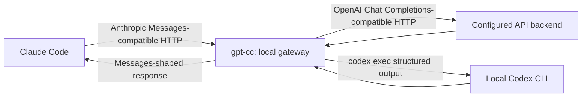

# gpt-cc

A local Python gateway that presents an Anthropic Messages-compatible endpoint to Claude Code and translates supported requests to either an OpenAI Chat Completions-compatible API or a local Codex CLI invocation.

## Status & honesty

**Status:** active compatibility harness. **Result:** No headline performance result; the deliverable is the harness. The current offline suite has 29 unit tests covering request mapping, model selection, tool/message translation, context edits, and boundary cases. This is not official Anthropic, OpenAI, Claude Code, or Codex software; it does not create an API key or reuse private session credentials.

## Architecture

- Claude Code remains the outer runtime: it owns prompts, settings, permissions, hooks, local MCP configuration, agents, and the tool loop.
- `gpt-cc` accepts the local Messages-compatible boundary (`POST /v1/messages` and `POST /v1/messages/count_tokens`) and resolves models with `model-map.json` or `OPENAI_MODEL`.
- API mode translates supported Anthropic message/content blocks, client function tools, streaming SSE, selected reasoning controls, and documented context edits to an OpenAI Chat Completions-compatible endpoint.
- Codex CLI mode invokes `codex exec --ephemeral --ignore-rules --sandbox read-only`, requests structured output, then maps text or tool-use blocks back to Messages-shaped responses.
- Unknown request fields, unsupported server-side tools, and unknown context edits fail closed. `top_k` and `container` are no-ops; document blocks become a placeholder; thinking content is not recreated as visible reasoning.



## The interesting decision

The gateway is deliberately an endpoint adapter, not a reimplementation of either client runtime. The Codex path delegates authentication to the installed CLI instead of scraping web sessions or using unofficial HTTP endpoints. Features without a reliable Chat Completions equivalent fail closed; two documented context edits are applied locally and reported. The tradeoff is lower apparent compatibility in exchange for avoiding silent tool, state, or context loss. API mode is more faithful than the Codex fallback, whose output is pseudo-streamed only after the command completes.

## Provenance

- Protocol boundary: the public Anthropic Messages API request/response shape, used locally for Claude Code gateway configuration; this repository is not affiliated with Anthropic.
- API backend boundary: an OpenAI Chat Completions-compatible endpoint and its `/models` discovery endpoint; this repository is not affiliated with OpenAI and does not claim an OpenAI API implementation.
- CLI fallback boundary: the locally installed `codex` CLI's `codex exec` command. Authentication is delegated to that CLI; this project neither reads nor exports Codex credentials.
- Compatibility claims are implemented in `anthropic_openai_gateway.py`, configured in `model-map.json`, specified in `FEATURES.md`, and tested in `tests/test_gateway.py`. No external router project code is vendored.
- **License:** UNKNOWN. No license file or authorship/provenance record establishes that an MIT grant is appropriate, so no license was added.

## Run it

Requirements: Python 3.11+, a local `claude` CLI for the wrapper path, and either a configured OpenAI-compatible API backend or a locally authenticated `codex` CLI. Keep credentials in environment variables or a local secret manager; do not put them in this repository.

```powershell
# Windows PowerShell: offline validation and local gateway
cd C:\path\to\gpt-cc
python -m unittest discover -s tests -v
.\gpt-cc.ps1 doctor
.\gpt-cc.ps1 gateway
```

In a second PowerShell window, start Claude Code through the gateway:

```powershell
cd C:\path\to\your-project
C:\path\to\gpt-cc\gpt-cc.ps1 claude
```

Optional wrapper onboarding and controls:

```powershell
cd C:\path\to\gpt-cc
.\install-powershell-wrapper.ps1
claude                  # uses the gateway when the wrapper is enabled
claude --real           # runs the real Claude executable
gpt-cc-off              # disables the wrapper for this shell
gpt-cc-on               # re-enables the wrapper for this shell
gpt-cc-status           # shows wrapper state
.\gpt-cc.ps1 exec "Inspect this repo and summarize it."
```

```sh
# macOS/Linux
cd /path/to/gpt-cc
python3 -m unittest discover -s tests -v
./gpt-cc doctor
./gpt-cc gateway

# In a second shell
cd /path/to/your-project
/path/to/gpt-cc/gpt-cc claude
```

For the direct API path, configure `OPENAI_API_KEY` or `OPENAI_BASE_URL` outside the repository and use `GPT_CC_BACKEND=openai` if needed. For the CLI fallback, run `./gpt-cc.ps1 login` on Windows (or `codex login` on POSIX) and use `GPT_CC_BACKEND=codex` if needed. `auto` uses API mode when API configuration exists and otherwise uses the local Codex CLI path.

## Limitations

- The gateway does not translate Anthropic server-side tools, Messages API `mcp_servers`, provider-side prompt caching, or unimplemented Claude-specific beta fields.
- Local Claude Code MCP works only when Claude Code exposes the resulting action as a normal client tool; it is not converted into provider-side MCP.
- Base64/URL images and client tool calls are mapped; document blocks are placeholders. The gateway does not make GPT reasoning tokens visible as Anthropic thinking blocks.
- Model routing depends on `model-map.json`, an exact `OPENAI_MODEL` override, or the configured backend's `/models` response; an unavailable or incompatible model endpoint can prevent resolution.
- This project has no measured latency, throughput, accuracy, cost, or benchmark result in the repository. See `FEATURES.md` and `SECURITY.md` for the detailed compatibility and security policies.